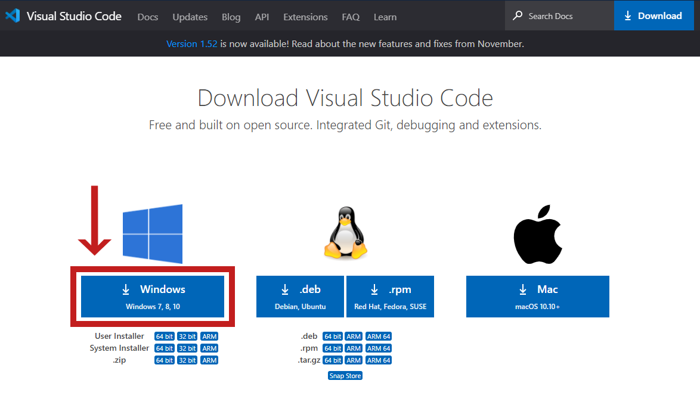

### 前回のあらすじ

>当サイトは[React](https://ja.reactjs.org/)の学習を兼ねたポートフォリオとして作成しました。<br>
>ひとまず土台が完成したため、今後は以下のロードマップを目安に少しずつ改修を進めていきます。
>また、せっかくですので個人ブログとしても積極的に活用していきたいと考えています。<br>
>具体的にはReactやC#の技術発信、フリーランスエンジニアとしての活動、雑記などなどを継続的に記事の追加をしていければ嬉しいです。

前回の記事ではスタートアップにあたり、ポートフォリオ作成のきっかけとアーキテクチャの選定理由を4点に分けてお話ししました。<br>
当記事ではReact + Gatsbyで作るサイトの開発環境・サイトの新規作成の過程を解説します。

　<small>前回：[【スタートアップ編Ⅰ】React + GatsbyJSを選んだ理由](/2020-12-13/)</small>

---

### 前提知識：Reactとは？

- [React](https://ja.reactjs.org/)はFacebook社が開発を主導したオープンソースのJavaScriptライブラリです。
- UIを作るためのライブラリであり、Angular、Vueと並ぶJavaScriptの三大人気フレームワーク（ライブラリ）のひとつに数えられており、欧州を中心に流行しています。
- JavaScriptにクラス、型の概念を取り入れた **[TypeScript](https://www.typescriptlang.org/ja/)** との組み合わせが容易であり、非常に相性が良いです。

---

### 前提知識：Gatsbyとは？

- [Gatsby](https://www.Gatsby.com/)は<ruby>SSR<rp></rp><rt>サーバーサイドレンダリング</rt><rp></rp></ruby>（JavaScriptが行う画面側の処理の一部をサーバー側で実行させて、ユーザーの待機時間を短くする技術）を実現する、Reactベースの<ruby>SSG<rp></rp><rt>静的サイトジェネレーター</rt><rp></rp></ruby>です。
- SSRによりサーバー側の処理を減らすことでレスポンスの高速化を図ることできます。

---

### 前提知識：Node.js / npmとは？
- [Node.js](https://nodejs.org/ja/)はサーバー側で動作されるJavaScript実行環境です。（概要の把握だけで大丈夫です。）<br>
- <ruby>npm<rp></rp><rt>Node Package Manager</rt><rp></rp></ruby>はNode.jsのパッケージを管理するツールで、Gatsbyのプラグイン（拡張機能）のインストール時に使用します。

---

### Visual Studio Codeのインストール

[Visual Studio Code](https://azure.microsoft.com/ja-jp/products/visual-studio-code/)はMicrosoftが開発した軽量コードエディタです。クロスプラットフォームですのでWindows、Macのどちらでも動作します。<br>
今回の開発ではIDE（統合開発環境）としてVisual Studio Codeを使用します。（Visual Studio Codeの大まかな使用方法については割愛いたします。）

[公式サイト](https://code.visualstudio.com/download)からダウンロードし、インストールします。（自環境に合わせて今回はWindowsを選択。設定は基本デフォルト。）



---

### 拡張機能の追加（npm）

1. Visual Studio Codeを起動して拡張機能のタブを開き、「[npm support for VS Code](https://marketplace.visualstudio.com/items?itemName=eg2.vscode-npm-script)」をインストールします。


これでVisual Studio Codeの「ターミナル」からnpmのコマンドが使えるようになります。<br>
※他にも[Japanese Language Pack for Visual Studio Code](https://marketplace.visualstudio.com/items?itemName=MS-CEINTL.vscode-language-pack-ja)というVisual Studio Codeの日本語化パッチを追加しています。お好みでどうぞ！

2. 「cmd（コマンドプロンプト）」の新しいターミナルを開きます。（既にGit Bashをインストール済の場合は「bash」でも大丈夫です。）


※「cmd」にならない場合は「既定のシェルの選択」で「Command Prompt」を選択した後、再度新しいターミナルを開きます。


3. 以下のコマンドを入力し、npmのバージョンを確認します。（インストールされたかチェック。）

```bash
npm --version
```

最新のバージョンの値が表示されれば成功です。

```cmd
C:\Users\xxxx>npm --version
6.14.8
```

---

### Gatsby CLIのインストール、サイトの新規作成

1. 以下のコマンドを入力し、[gatsby-cli](https://www.gatsbyjs.com/docs/gatsby-cli/)をインストールします。

```bash
npm install -g gatsby-cli
```

これでGatsbyの各種コマンドが使えるようになります。

2. `[gatsby new]`コマンドを使い、ローカルに新しいサイトを作成します。
`[gatsby new]`コマンドの構文は以下です。

```bash
gatsby new [<site-name> [<starter-url>] ]
```

| 引数 | 説明 |
| :-- | :-- |
|   site-name   |   サイト名。ここに指定した名前がディレクトリ名になります。  |
|   starter-url   |   **Gatsby Starters**のURLまたはローカルファイルパス。ここに記載されたソースがコピーされてローカルに展開されます。デフォルトは https://github.com/gatsbyjs/gatsby-starter-default   |

この`[starter-url]`はGitHubのURLを指定することができ、そのソースを丸ごとコピーしてくれます。この**Gatsby Starters**がGatsbyの利点のひとつです。<br>
個人・コミュニティが作成した非常に多くのスターターが公開されており、そこから自分の好みに合ったイイ感じのスターターを選択するだけでローカルにGatsbyのサイトが出来上がります！<br>
　<small>参考：[Starter Library | Gatsby](https://www.gatsbyjs.com/starters/?v=2)</small>

今回私は人気スターターの[gatsby-starter-ghost](https://gatsby-casper-theme.netlify.app/)から派生した[gatsby-casper](https://gatsby-casper.netlify.app/)をスターターに選択しました。

```bash
gatsby new blog https://github.com/scttcper/gatsby-casper
```

3. `[gatsby develop]`コマンドを使い、ローカルでビルド&サイトを立ち上げます。`[gatsby develop]`コマンドの構文は以下です。

```bash
gatsby develop
```

`[gatsby develop]`コマンドはオプションを指定できます。特に支障がなければすべて未指定で問題ありません。

| オプション | 説明 |
| :-- | :-- |
|   -H、--host  |   ホスト名を指定できます。デフォルトは`localhost`  |
|   -p、--port  |   ポートを指定できます。デフォルトは`env.PORT`または`8000`   |
|   -o、--open  |   既定のブラウザでサイトを開きます。  |
|   -S、--https  |   HTTPSを使用して開発サーバーを立ち上げます。  |

以下のメッセージが表示されれば成功です。

```bash
You can now view args.engineer in the browser.
⠀
  http://localhost:8000/
⠀
View GraphiQL, an in-browser IDE, to explore your site's data and schema
⠀
  http://localhost:8000/___graphql
```

**`http://localhost:8000/`**に接続するとローカルで立ち上がったサイトを確認できます。<br>
また、**`http://localhost:8000/___graphql`**に接続すると[GraphiQL](https://www.gatsbyjs.com/docs/running-queries-with-graphiql/)というブラウザ上でGraphQLのクエリを組み立てて実行できるツールを使用できます。<br>
（GraphQLについては追々別項にて。）

このローカル環境に作成されたコピーをもとに、自分の目指すサイトをイメージしながら改修を加えていきます。

次回は**「コーディング（実装）・デバッグ」**編になります。<br>
　<small>次回：[【スタートアップ編Ⅲ】コーディング（実装）・デバッグ](/2020-12-17/)</small>

---

##### オマケ話 ～Arg流のプログラミング勉強方法～

今回のポートフォリオ作成にあたって、まずはスターターという先駆者の作品に触れることから始めています。

少し脱線しますが、何を作成するにしても一から作り上げるのは、たとえ設計だけであろうと途方もない労力が必要になります。<br>
特に新しい概念に触れる場合、基礎を最初の"1"から学びながら実際に組み立てていかなければなりません。そうしてすべてを"1"から始めてしまうと、<u>本当にやりたかったことを始められず、"2"にたどり着けず力尽きてしまう</u>こともあります。

しかし、幸いにもプログラミングという分野は<mark>「書き」</mark>と<mark>「読み」</mark>に分かれています。<br>
自分で"1"から<mark>「書き進めて」</mark>学ぶより、完成したものを<mark>「読み解く」</mark>方がのみ込みの早いときがあります。

私は<u>「完成している（≒実際に動作している）コードを読み解いて、"2"～"10"を実践しながら学ぶこと</u>はとても良いプログラミング勉強方法だと感じています。「習うより慣れよ」ということでしょうか。<br>
実際に、参考書やサンプルを探し回るよりも、現場でコードを触れて手を加えることが一番の経験値でした。

自分では思いつかない発想や技術を見て、それを自分のものにできた瞬間、とてもワクワクしますよね。<br>
繰り返し手を加えていきながら、ゆくゆくはGatsbyの最良のアーキテクチャを見つけたいものです。