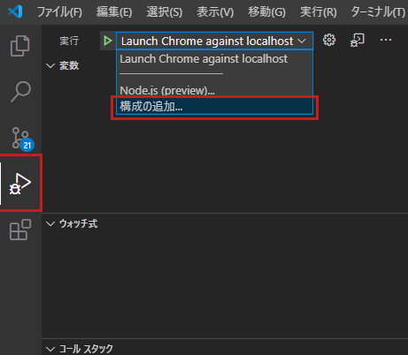

### 前回のあらすじ

>当サイトは[React](https://ja.reactjs.org/)の学習を兼ねたポートフォリオとして作成しました。<br>
>ひとまず土台が完成したため、今後は以下のロードマップを目安に少しずつ改修を進めていきます。
>また、せっかくですので個人ブログとしても積極的に活用していきたいと考えています。<br>
>具体的にはReactやC#の技術発信、フリーランスエンジニアとしての活動、雑記などなどを継続的に記事の追加をしていければ嬉しいです。

前回の記事ではReact + Gatsbyで作るサイトの開発環境・サイトの新規作成の過程をお話ししました。<br>
当記事では実際のコーディング（実装）・デバッグ方法を解説します。

　<small>前回：[【スタートアップ編Ⅱ】開発環境・サイトの新規作成（Gatsby Starters）](/2020-12-15/)</small>

---

### ローカル環境のビルド＆サイトの立ち上げ

`[gatsby new]`コマンドと**Gatsby Starters**を使ってローカル環境に作成したコピーを、`[gatsby develop]`コマンドを使い開発サーバーを立ち上げます。`[gatsby develop]`コマンドの構文は以下です。

```bash
gatsby develop
```

`[gatsby develop]`コマンドはオプションを指定できます。特に支障がなければすべて未指定で問題ありません。

| オプション | 説明 |
| :-- | :-- |
|   -H、--host  |   ホスト名を指定できます。デフォルトは`localhost`  |
|   -p、--port  |   ポートを指定できます。デフォルトは`env.PORT`または`8000`   |
|   -o、--open  |   既定のブラウザでサイトを開きます。  |
|   -S、--https  |   HTTPSを使用して開発サーバーを立ち上げます。  |

以下のメッセージが表示されれば成功です。

```bash
You can now view args.engineer in the browser.
⠀
  http://localhost:8000/
⠀
View GraphiQL, an in-browser IDE, to explore your site's data and schema
⠀
  http://localhost:8000/___graphql
```

**`http://localhost:8000/`**に接続するとローカルで立ち上がったサイトを確認できます。<br>
また、**`http://localhost:8000/___graphql`**に接続すると[GraphiQL](https://www.gatsbyjs.com/docs/running-queries-with-graphiql/)というブラウザ上でGraphQLのクエリを組み立てて実行できるツールを使用できます。<br>
（GraphQLについては追々別項にて。）

Gatsbyにはホットリロード機能が備わっており、ビルド後はリロードせずとも更新内容がリアルタイムに反映されます。（ファイルを保存したタイミングがトリガー。）<br>
`gatsby-config.js`や`gatsby-node.js`など初回ビルド時に実行されるファイルを除き、更新に大した時間はかかりません。<br>
<mark>動作を確認→ソースを修正→動作を確認…</mark>という流れが容易になるため、大変開発しやすいですね。

　補足：ビルド状態を解除するには`Ctrl + C`を同時に押下します。

---

### ブラウザによるクライアントのデバッグ実行（Debugger for Chrome）

さて、JavaScriptだからここでブラウザの開発者ツールを使ってデバッグを**…とはいかず、**デフォルトの状態では開発者ツールでデバッグすることができません。<br>
開発者ツールでReactのデバッグを行う場合は[React Developer Tools](https://chrome.google.com/webstore/detail/react-developer-tools/fmkadmapgofadopljbjfkapdkoienihi?hl=ja)などブラウザのプラグインを追加します。

今回の開発ではブラウザにGoogle Chromeを使い、Visual Studio Codeの拡張機能である[Debugger for Chrome](https://marketplace.visualstudio.com/items?itemName=msjsdiag.debugger-for-chrome)を利用したデバッグ方法を紹介します。

- まずはVisual Studio CodeからDebugger for Chromeをインストールします。


- インストール完了後デバッグのタブを開き、「構成の追加」を選択します。未作成の場合`launch.json`が作成されます。<br>



- 表示されるメニューから`Chrome: Launch`を選択します。


`launch.json`の`url`の値を`http://localhost:8000`に変更します。（デフォルトでは`http://localhost:8080`）<br>
`name`（構成の名称）は任意の値に変更が可能です。

```json
// launch.json
{
    "version": "0.2.0",
    "configurations": [
        {
            "type": "chrome",
            "request": "launch",
            "name": "Launch Chrome against localhost",
            "url": "http://localhost:8000",
            "webRoot": "${workspaceFolder}"
        }
    ]
}
```

- 動作を確認したい行にブレークポイントを付けます。(拡張子が .js、.ts、.tsx　のファイル。）


- ローカル環境のビルド&サイトが立ち上がっている状態でデバッグタブの実行アイコンをクリック、デバッグを開始します。


- ブレークポイントの地点で処理が一時停止します。この状態で変数にカーソルを合わせると格納されている値が確認できるようになります。<br>
勿論一時停止だけではなくステップイン、ステップオーバー、ステップアウトもできます。


Debugger for Chromeの詳しい使い方についてはここでは割愛します。<br>
　<small>参考：[Debugger for Chrome - Visual Studio Marketplace](https://marketplace.visualstudio.com/items?itemName=msjsdiag.debugger-for-chrome)</small>

また、Gatsbyのより進んだデバッグ方法については公式に記載がありますのでご参照ください。<br>
　<small>参考：[Debugging | Gatsby](https://www.gatsbyjs.com/docs/debugging/)</small>

---

### 本番環境のビルド＆サイトの立ち上げ

`[gatsby develop]`コマンドはデバッグを行うための開発サーバーを立ち上げるコマンドになります。<br>
本番環境のビルドを行う場合は`[gatsby build]`および`[gatsby serve]`コマンドを使用します。

```bash
gatsby build
```

```bash
gatsby serve
```

`[gatsby serve]`コマンド入力後、以下のメッセージが表示されれば成功です。

```bash
You can now view args.engineer in the browser.
⠀
  http://localhost:9000/
```

`[gatsby build]`および`[gatsby serve]`コマンドは、主にリモートリポジトリへのソースのpushをトリガーにして本番環境にデプロイする場合などに使用します。

ローカル環境の開発においての用途は、開発サーバーでは動作しないプラグインやモジュールの確認を行う時など。<br>
例えばGatsbyのプラグインである[gatsby-plugin-google-analytics](https://www.gatsbyjs.com/plugins/gatsby-plugin-google-analytics/)（Google Analyticsのスクリプト埋込）は本番環境用のビルド時にしか行われません。

※`[gatsby serve]`コマンドでサイトを立ち上げた場合、`[gatsby develop]`コマンドと異なりホットリロードではありませんのでご注意ください。

---

### 補足：ビルド＆サイトの立ち上げがうまくいかないとき

- 特に何かを変更した覚えがないのにビルドが失敗する
- 画像がうまく表示されない
- 変更前のリソースが適用されてしまう

などといった場面に遭遇した場合、キャッシュが悪さをしている可能性があります。そんな時は`[gatsby clean]`コマンドを使いましょう。

```bash
gatsby clean
```

このコマンドは`.cache`フォルダ（キャッシュ）と`public`フォルダ（ビルド時に作成されるリソース）の中身を削除します。<br>
`[gatsby clean]`コマンドを入力した後、改めて`[gatsby develop]`や`[gatsby build]`コマンドを入力してください。

---

### 補足：gatsby-cliの詳細

各コマンドの詳細な内容については以下をご参照ください。<br>
　<small>参考：[Commands (Gatsby CLI) | Gatsby](https://www.gatsbyjs.com/docs/gatsby-cli/)</small>

---

これで簡単な動作確認が一通り可能になりました。<br>
このように、デバッグで逐一内容を確認しながら実装を進めていきます。

次回は**「GitHub・Netlifyを使ったデプロイ」**編になります。