### 前回のあらすじ

>当サイトは[React](https://ja.reactjs.org/)の学習を兼ねたポートフォリオとして作成しました。<br>
>ひとまず土台が完成したため、今後は以下のロードマップを目安に少しずつ改修を進めていきます。
>また、せっかくですので個人ブログとしても積極的に活用していきたいと考えています。<br>
>具体的にはReactやC#の技術発信、フリーランスエンジニアとしての活動、雑記などなどを継続的に記事の追加をしていければ嬉しいです。

前回の記事では実際のコーディング（実装）・デバッグ方法をお話ししました。<br>
当記事ではリモートリポジトリの作成およびVisual Studio Codeを使ったGitHubへのプッシュを解説します。

　<small>前回：[【スタートアップ編Ⅲ】コーディング（実装）・デバッグ](/2020-12-17/)</small>

---

### Gitのインストール

ソースの管理を行うために[Git](https://git-scm.com/)をインストールします。<br>
Windowsでの開発になりますので`Git for Windows`を選択します。選択すると自動でインストーラーのダウンロードが始まります。

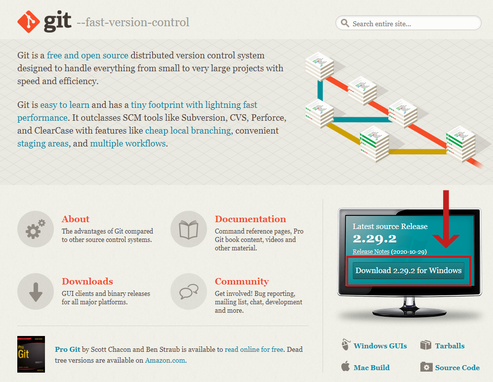

基本的にデフォルトの選択肢でOKですが、`Choosing the default editor used by Git`の部分だけ`Use Visual Studio Code as Git's default editor`を選択してください。<br>
既にVisual Studio Codeがインストール済の場合はGit Bashの設定が自動で追加されます。

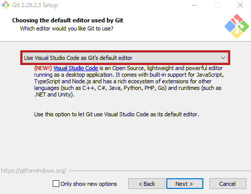

もし設定を間違えた、または先にGitのインストールから行った場合はVisual Studio Codeの設定を変更します。<br>
Visual Studio Codeを開き、`Ctrl + Shift + P`を押下してコマンドパレットを呼び出し、`Open Settings（JSON）`を選択します。

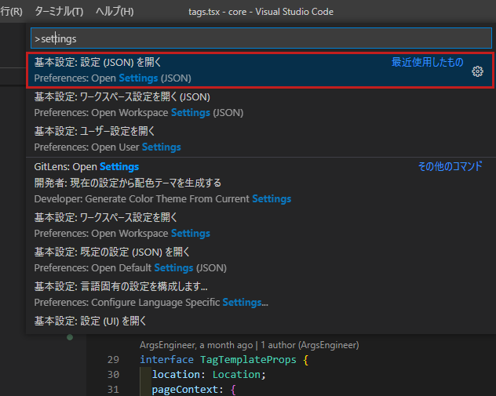

`settings.json`が開かれるので、全体を囲う`{}`の内側に以下の一行を追加します。<br>
この設定によりターミナルからGit Bashが開けるようになります。

```json
{
    // フォルダのパスはインストールしたGitのbash.exeの位置を指定してください。
    "terminal.integrated.shell.windows": "C:\\Program Files\\Git\\bin\\bash.exe",
}
```

---

### ローカルリポジトリの初期化

Gitで管理したいソースが作成済と仮定してローカルで`master`ブランチを作成→リモートリポジトリにプッシュという順番で行います。

Gitで管理しているフォルダを選択していない時、Visual Studio Codeの下帯は紫色の状態になります。

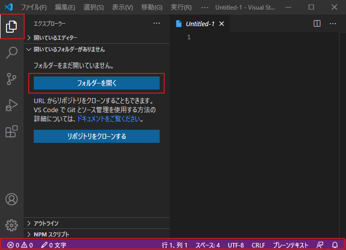

まずはGitで管理したいフォルダを選択します。フォルダを選択するとVisual Studio Codeの下帯が青色の状態になります。<br>
（Gatsby Starterからコピーを作成した場合、コピーを配置したフォルダの一番上の階層になります。）

次に、`リポジトリを初期化する`を選択します。

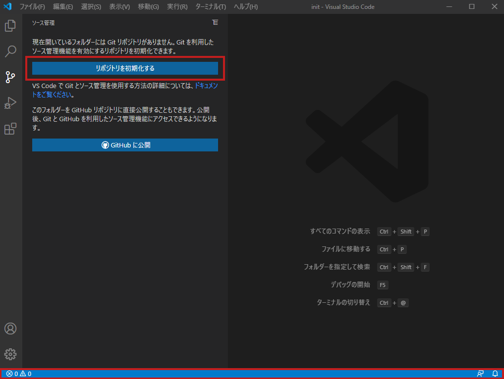

`[git init]`コマンドが実行され、選択したフォルダに`.git`ファイルが作成されます。（表示されない場合は隠しファイルの表示をONにしてみてください。）

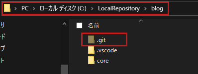

この`.git`ファイルと同階層のフォルダ以下がGitリポジトリ管理の単位になります。<br>
例えば私の場合は`blog`フォルダを選択していますが、ひとつ上の階層になる`LocalRepository`フォルダには他にもGitで管理しているフォルダがあります。<br>
こうしてフォルダを分ければGitリポジトリ同士でソースが競合することはありません。

---

### ローカルリポジトリへのコミット

次に、最初のコミットを行います。コミットとはGitリポジトリに修正内容を登録することを指します。<br>
Visual Studio CodeはGitの連携に力を入れており、**GUI（マウスを使ったグラフィカルな操作）ベース**で基本的なGitの操作が可能です。

リポジトリの初期化が完了すると左下に`master`という文字が表示されるようになります。これは現在チェックアウトしているブランチを差し、初期化直後は必ず`master`ブランチになります。<br>
文字の右側の雲のアイコンはリモートリポジトリを登録していない場合に表示されます。

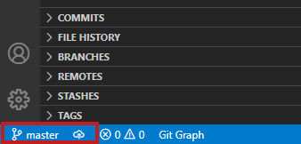

また、ファイルを新規に追加すると`master`の文字の右上に`*`のアイコンが付きます。これはまだステージしていないファイルが存在する場合にチェックされます。
ステージとは簡単に言えばコミット対象のファイルのことです。（厳密には異なります。）<br>
コミットする際は必ずファイルのステージから行う必要があります。

ファイルにカーソルを合わせると右側に`+`のアイコンが表示され、押下すると選択したファイルがステージされます。

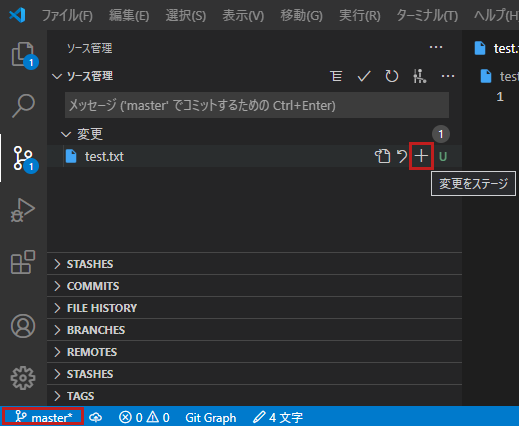

ステージしたファイルがあると`master`の文字の右上に`+`のアイコンが付きます。

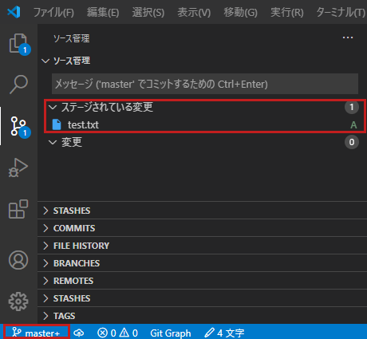

ステージしたファイルをコミットしましょう。上部のテキストエリアにコミットメッセージを記載し、`✓`のアイコンを押下します。<br>
ステージしたファイルがクリアされて`master`の文字右上の`+`のアイコンが消えたらコミット完了です。

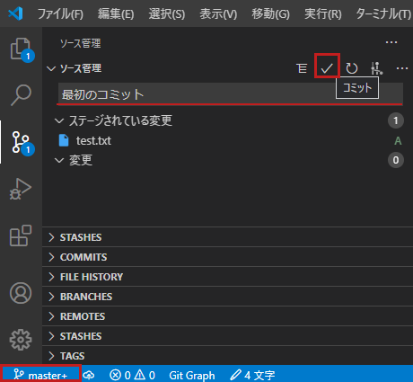

Gitは本来**CUI（コマンド操作）ベース**のツールですが、このようにVisual Studio Codeでは基本的な操作であれば画面上から行うことができます。

---

### リモートリポジトリの作成とGitHubへのプッシュ

次に、ソースを管理するリモートリポジトリに**GitHub**を使用します。リモートリポジトリとはネットワーク上のリポジトリのことで、リモートリポジトリにローカルのリポジトリのコミットを同期することでリモートリポジトリを介して作業の共有が可能になります。<br>
GitHubはリモートリポジトリを提供するプラットフォームの大手で、個人開発のレベルであれば基本無料です。

[公式ページ](https://github.co.jp/)からGitHubのアカウントを新規に作成します。プランは`Free`を選択します。手順については以下のサイト様が参考になります。（新規作成にはメールアドレスが必要です。）<br>
　<small>参考：[1分もかからない！5ステップでGitHubアカウント作成 | アールエフェクト](https://reffect.co.jp/html/create_github_account_first_time)</small>

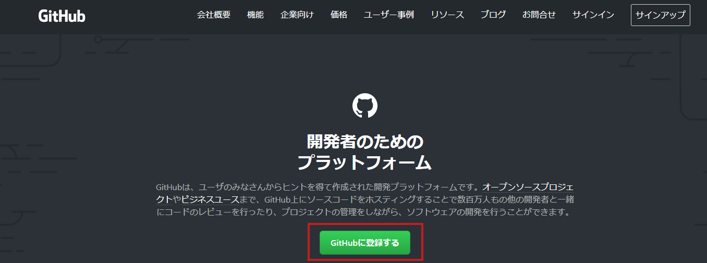

アカウント作成＆ログイン後、リポジトリを作成します。`Repositories`タブを選択し、`New`ボタンを押下します。

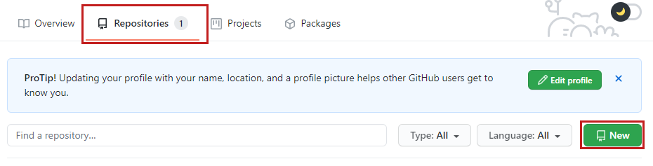

`Repository name`には好きな名前を付けて良いです。（リポジトリURLの一部になります。）<br>
アクセス権限は特に理由がなければ`Private`、ポートフォリオなど、第三者に公開したい場合は`Public`に設定し、`Create repository`を押下します。

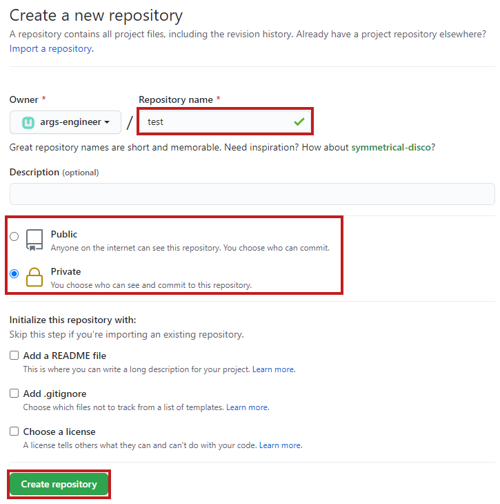

リポジトリ作成後、リポジトリのページに移動してリポジトリURLをコピーします。`Code`ボタンを押下してメニューを表示し、クリップボードのアイコンを押下するとリポジトリURLが自動でコピーされます。（画像は既に同期済のものになります。）

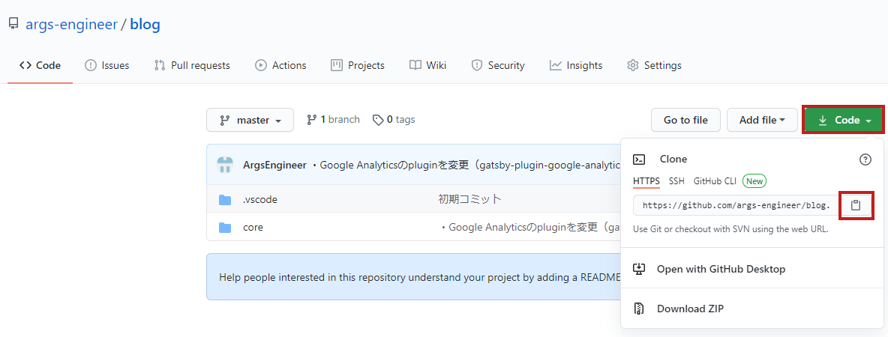

Visual Studio Codeの操作に戻ります。以下のコマンドを入力してリモートリポジトリのURLを登録します。

```bash
git remote set-url origin [リポジトリURL].git
```

最後に、ローカルの`master`ブランチをプッシュ（アップロード）します。

```bash
git push origin master
```

これでリモートリポジトリとの同期が完了します。<br>
成功すれば`master`の文字の右側の雲のアイコンが、矢印のアイコン（同期が完了している意味合い）に切り替わります。

---

##### 補足：コミットのタイミング

私の場合はある程度ソースを完成させてから最初のコミットを行いましたが、本来はもっと早い段階で行い、追加・修正の度にコミットを繰り返します。<br>
コミットは<mark>修正履歴の保存、いわばセーブポイント</mark>です。できる限り作業内容をこまめに登録しましょう。

また今回は個人開発かつ今のところソースを分離する必要がないため、`master`ブランチひとつだけで運用しています。<br>
逆に複数人で編集したりある程度大きな機能を追加する場合は開発用の`develop`ブランチを作成し、さらに`develop`ブランチから作業者または機能単位で`feature`ブランチを作成することをおすすめします。

Gitの一般的なブランチモデルについては以下が参考になります。<br>
　<small>参考：[git-flow cheatsheet](https://danielkummer.github.io/git-flow-cheatsheet/index.ja_JP.html)</small><br>
　<small>参考：[Git-flowって何？ - Qiita](https://qiita.com/KosukeSone/items/514dd24828b485c69a05)</small>

ブランチへコミットする際は必ず<mark>「正常に動作するソースになっていること」</mark>を確認しましょう。
1. 構文エラーが発生していないか【コンパイルエラー】<br>
追加・修正後の動作確認が不十分だと見過ごすことがあります。<br>
Visual Studio Codeの場合構文エラーがあるとファイル名が赤色に変化するので、最低限これが発生していないことをチェックしましょう。

2. ビルドが失敗するようになっていないか【ビルドエラー】<br>
こちらも1と合わせて必ず確認しましょう。特に、簡単な修正を行った時は**「大丈夫だろう」**と思い込み動作確認を怠ることが多いです。

3. 動作しなくなるページ（機能）がないか【実行時エラー】<br>
すべての実行時エラーを確認するのは至難の業です。例えば、実際に起きやすい現象は以下のような例です。
    - 定数を変更したら不正な引数扱いになってしまった（設定ミス）
    - あるページ（機能）だけに使われているソースを修正したら何故か別のページ（機能）にも影響が出てしまった（影響範囲の誤認）
    - リファクタリング（動作は変えずにソースコードを整理すること）をしたらある機能が動かなくなった（テスト不足）

    3のチェックは<u>実装、テストのレベルをどこまで引き上げるか</u>という話と密接に関わるため、**「ここまで確認すれば十分」**といったラインはありません。<br>
    ただし、最低限**「すべてのページ（機能）が正常に開けるか（使えるか）」**のチェックは行うように心がけましょう。<br>

---

これでGitHubにリモートリポジトリを作成し、ローカルリポジトリと同期できるようになりました。<br>
そしてリモートリポジトリを作成したことにより、GitHubとホスティングサービスを連携させてサイトを公開できるようになります。

次回は**「Netlifyを使ったサイト公開」**編になります。
　<small>次回：[【スタートアップ編Ⅴ】Netlifyを使ったサイト公開](/2020-12-26/)</small>