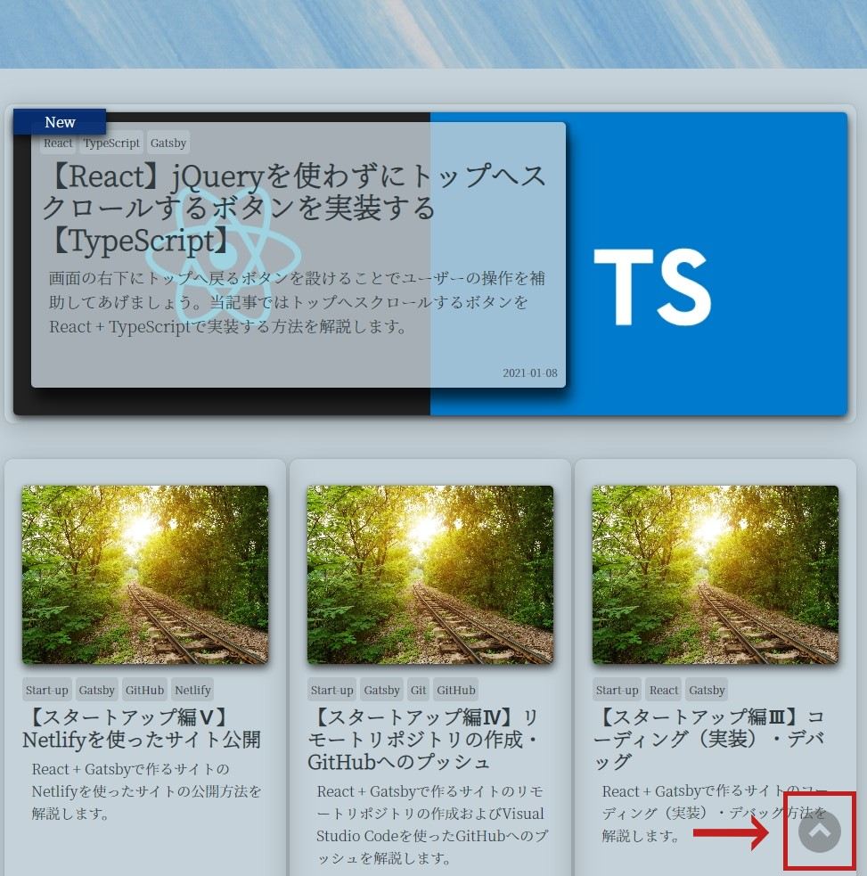

## 当記事について

### トップへスクロールするボタンとは？

PCからWebサイトを閲覧する場合、ページのスクロールが際限なく下へ流れてしまうと先頭（トップ）へ戻る手間が増えてしまいます。<br>
そこで、画面の右下にトップへ戻るボタンを設けることでユーザーの操作を補助してあげましょう。

※スマートフォンからWebサイトを閲覧する場合は狭い画面を圧迫してしまうことから不要とも言われています。<br>
しかし、スマートフォンの大型化に伴い、片手では画面のトップに指が届かないという方も増えているようです。

### jQueryを使わずに実装する



当サイトにも画面の右下にトップへスクロールするボタンを設置しております。<br>
`jQuery`を利用した実装方法を紹介するページが多いですが、当記事ではこのトップへスクロールするボタンを`jQuery`は使わずに`React` + `TypeScript`で実装する方法を解説します。

---

## 実装のポイント

### ボタンをReactコンポーネントとして作成する

Reactコンポーネントとして`div`要素でボタンを作成し、onClickイベントにスクロール処理を追加します。<br>
（コンポーネントの分離は再利用性と保守性の向上に繋がります。）

```tsx
// ScrollToTop.tsx
import React from 'react';

export const ScrollToTop: React.FC = () => {
  return <div onClick={ /*スクロール処理*/} />;
};

```

### window.scrollを使ってスクロールさせる

スクロールの動作はブラウザ標準の[window.scroll](https://developer.mozilla.org/ja/docs/Web/API/Window/scroll)を使用します。<br>
スクロールのオプションに`top`と`behavior`を設定することで、スクロールの位置とふるまいを指定できます。<br>
（トップまでなめらかにスクロール）

```tsx
// ScrollToTop.tsx
import React from 'react';

export const ScrollToTop: React.FC = () => {
  return <div onClick={scroll} />;
};

const scroll = (): void => {
  typeof window !== 'undefined' &&
    window.scroll({
      top: 0, // 最上部へスクロール
      behavior: 'smooth',
    });
};

```

ちなみに`window`インターフェイスはブラウザの機能でありGatsbyのビルド時`undefined`になってしまうため、以下の条件文を追加します。

```tsx
typeof window !== 'undefined' &&
```
### CSSでアイコン画像を指定する + アニメーションを付与する

[emotion](https://emotion.sh/docs/introduction)という`CSS-in-JS`ライブラリを利用してCSSの設定を行います。<br>
このライブラリを使うことで文字列に記載したCSSの属性を変数として要素に渡すことができ、CSSのスコープを狭めることができます。<br>
（慣れると便利！）

```tsx
// ScrollToTop.tsx
import React from 'react';

export const ScrollToTop: React.FC = () => {
  return <div css={[ScrollToTopStyles]} onClick={scroll} />;
};

const scroll = (): void => {
  typeof window !== 'undefined' &&
    window.scroll({
      top: 0, // 最上部へスクロール
      behavior: 'smooth',
    });
};

const ScrollToTopStyles = css`
  background-image: url(${require('../../content/img/scroll-to-top.png')});
  cursor: pointer;
  position: fixed;
  right: 5%;
  bottom: 5%;
  min-width: 48px;
  min-height: 48px;
  z-index: 100;
  transition: opacity 1s, visibility 1s, transform 0.5s;
  -webkit-transition: opacity 1s, visibility 1s, -webkit-transform 0.5s;
  opacity: 0.5;
  visibility: visible;

  /* PCのみ */
  @media (min-width: 795px) and (min-height: 795px) {
    :hover {
      transform: scale(1.2);
      -webkit-transform: scale(1.2);
    }
  }
`;

```

（アイコン画像は[こちら](https://icooon-mono.com/12262-%e7%9f%a2%e5%8d%b0%e3%83%9c%e3%82%bf%e3%83%b3-%e4%b8%8a3/)より拝借しました。）

画像を`background-image`属性で指定します。ポイントは<u>`require()`でパスを解決することです。</u><br>
GatsbyなどのSSGを介した場合、単に相対パスを記載しただけだとパスを解決できない点にご注意ください。

また、以下のCSSでマウスオーバーした時に少しだけサイズを大きくします。シンプルなデザインですが、動きを付けることで視認性や存在感がアップします。

ただしスマートフォンでは`hover`がうまく動作しないため、`@media`（メディアクエリ）で画面幅を判定し、PCのみ適用されるようにしましょう。
```css
  /* PCのみ */
  @media (min-width: 795px) and (min-height: 795px) {
    :hover {
      transform: scale(1.2);
      -webkit-transform: scale(1.2);
    }
  }
```

### ステートフックを利用してページのトップかどうか判定する

ここで完成でも良いですが、ページトップへスクロールした後もボタンが表示され、クリックしても何も起きません。<br>
UXの観点から、見た目上有効なのに動作しないボタンを画面上に残しておくのは避けましょう。

ということで、Reactの**ステートフック**を利用してページトップかどうかを判定してボタンを非表示にします。

```tsx
import React, { useEffect, useState } from 'react';
import { css } from '@emotion/core';

export const ScrollToTop: React.FC = () => {
  const [isTop, setIsTop] = useState<boolean>(true);

  const onScroll = (): void => {
    if (getTop() >= 100) {
      setIsTop(false);
    } else {
      setIsTop(true);
    }
  };

  useEffect(() => {
    document.addEventListener('scroll', onScroll);
    return (): void => document.removeEventListener('scroll', onScroll);
  });

  return <div css={[ScrollToTopStyles, isTop ? HideScrollToTop : '']} onClick={scroll} />;
};

const getTop = (): number =>
  Math.max(window.pageYOffset, document.documentElement.scrollTop, document.body.scrollTop);

const scroll = (): void => {
  typeof window !== 'undefined' &&
    window.scroll({
      top: 0, // 最上部へスクロール
      behavior: 'smooth',
    });
};

const ScrollToTopStyles = css`
  background-image: url(${require('../../content/img/scroll-to-top.png')});
  cursor: pointer;
  position: fixed;
  right: 5%;
  bottom: 5%;
  min-width: 48px;
  min-height: 48px;
  z-index: 100;
  transition: opacity 1s, visibility 1s, transform 0.5s;
  -webkit-transition: opacity 1s, visibility 1s, -webkit-transform 0.5s;
  opacity: 0.5;
  visibility: visible;

  /* PCのみ */
  @media (min-width: 795px) and (min-height: 795px) {
    :hover {
      transform: scale(1.2);
      -webkit-transform: scale(1.2);
    }
  }
`;

const HideScrollToTop = css`
  z-index: 0;
  opacity: 0;
  visibility: hidden;
`;

```

**ステートフック**はReactにおいてコンポーネントの状態管理をするためのものです。<br>
そのため、ここで宣言するステートフックはコンポーネント内で完結した値になります。

ここでは`isTop`というboolean型の変数（初期値：true）を宣言しています。<br>
また、`isTop`に対応する`setIsTop()`を呼び出すことで`isTop`に任意の値をセットできます。<br>
（`isTop`に直接代入はできないため注意！）

```tsx
const [isTop, setIsTop] = useState<boolean>(true);
```

ページの垂直方向のスクロール量を取得します。<br>
100pxより大きい場合ページのトップであると判定し、`setIsTop()`を呼び出し`isTop`をtrueにします。

```tsx
const getTop = (): number =>
Math.max(window.pageYOffset, document.documentElement.scrollTop, document.body.scrollTop);
```

```tsx
const onScroll = (): void => {
  if (getTop() >= 100) {
    setIsTop(false);
  } else {
    setIsTop(true);
  }
};
```

`isTop`がtrueの場合、ボタンの透過度と`z-index`を0に、`visibility`を`hidden`（非表示）に設定します。<br>
`ScrollToTopStyles`（表示時のCSS）に`transition: opacity 1s, visibility 1s, transform 0.5s;`属性を追加することで表示/非表示が緩やかなアニメーションで表現されるようになります。

```tsx
return <div css={[ScrollToTopStyles, isTop ? HideScrollToTop : '']} onClick={scroll} />;
```

```tsx
const HideScrollToTop = css`
  z-index: 0;
  opacity: 0;
  visibility: hidden;
`;
```

最後に、ページ共通のWrapperである`Wrapper.tsx`に作成したコンポーネントを挿入します。<br>
これですべてのページの右下にボタンが表示されるようになりました。

```tsx
// Wrapper.tsx
import { ScrollToTop } from '../components/Animation/ScrollToTop';

export const Wrapper: React.FC<WrapperProps> = ({ children, className }) => (
  <StyledWrapper className={className}>
    {children}
    <ScrollToTop />
  </StyledWrapper>
);

```

---

## 全体のソースコード

```tsx
import React, { useEffect, useState } from 'react';
import { css } from '@emotion/core';

export const ScrollToTop: React.FC = () => {
  const [isTop, setIsTop] = useState<boolean>(true);

  const onScroll = (): void => {
    if (getTop() >= 100) {
      setIsTop(false);
    } else {
      setIsTop(true);
    }
  };

  useEffect(() => {
    document.addEventListener('scroll', onScroll);
    return (): void => document.removeEventListener('scroll', onScroll);
  });

  return <div css={[ScrollToTopStyles, isTop ? HideScrollToTop : '']} onClick={scroll} />;
};

const getTop = (): number =>
  Math.max(window.pageYOffset, document.documentElement.scrollTop, document.body.scrollTop);

const scroll = (): void => {
  typeof window !== 'undefined' &&
    window.scroll({
      top: 0, // 最上部へスクロール
      behavior: 'smooth',
    });
};

const ScrollToTopStyles = css`
  background-image: url(${require('../../content/img/scroll-to-top.png')});
  cursor: pointer;
  position: fixed;
  right: 5%;
  bottom: 5%;
  min-width: 48px;
  min-height: 48px;
  z-index: 100;
  transition: opacity 1s, visibility 1s, transform 0.5s;
  -webkit-transition: opacity 1s, visibility 1s, -webkit-transform 0.5s;
  opacity: 0.5;
  visibility: visible;

  /* PCのみ */
  @media (min-width: 795px) and (min-height: 795px) {
    :hover {
      transform: scale(1.2);
      -webkit-transform: scale(1.2);
    }
  }
`;

const HideScrollToTop = css`
  z-index: 0;
  opacity: 0;
  visibility: hidden;
`;

```

---

<small>参考：[ステートフックの利用法 – React](https://ja.reactjs.org/docs/hooks-state.html)</small><br>
<small>参考：[【React + Typescript】スクロール位置を取得するコンポーネント - Qiita](https://qiita.com/ragnar1904/items/184a10fbb4d216625aa8)</small>
