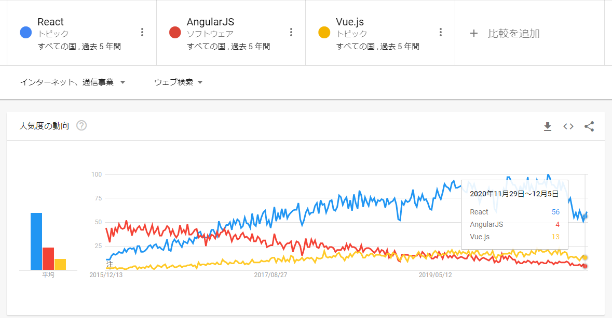

### はじめに

>当サイトは[React](https://ja.reactjs.org/)の学習を兼ねたポートフォリオとして作成しました。 
>ひとまず土台が完成したため、今後は以下のロードマップを目安に少しずつ改修を進めていきます。
>また、せっかくですので個人ブログとしても積極的に活用していきたいと考えています。 
>具体的にはReactやC#の技術発信、フリーランスエンジニアとしての活動、雑記などなどを継続的に記事の追加をしていければ嬉しいです。

当記事ではまずスタートアップにあたり、ポートフォリオ作成のきっかけとアーキテクチャの選定理由を4点に分けて解説します。

---

### 1. どうしてポートフォリオ？

<ruby>Portfolio<rp></rp><rt>ポートフォリオ</rt><rp></rp></ruby>とは鞄やファイルフォルダのように書類を運ぶケースを指す英単語です。 
そこから転じて、クリエイターの用語として「実績や能力をアピールするもの」、「自身の作品集」という意味合いがあります。 
ITエンジニアにおいてはよく自作のアプリ、ツール、デザインなどがポートフォリオに採用されます。

私は来年で業界6年目、フリーランスになって4年目を迎えようとしていますが、自身のポートフォリオと呼べるものがありませんでした。無論あるに越したことはないものの、これまで問題なく案件に参画できていた状態だったのです。

なぜなら、主に私が案件（※人員を募集しているプロジェクトのこと）に参画する際、これまでの経験を記載した**業務経歴書**をもとに先方と商談を行ってきたためです。（大半のエンジニアは案件に参画する際同じ流れだと思われます。） 
つまりほとんどの新卒応募者がしているように、商談では担当者と直接やり取りして **「言葉で信用を得る」** ように立ち回っていました。

そんな中、2020年は新型コロナウイルスの世界的な流行により、慢性的な人材不足にあるIT業界も少なからず打撃を受けることになりました。 
特にフリーランスエンジニアとして活動していく中で顕著に感じているのは **「総案件数の減少」** です。

私は業界入りから今日に至るまで、プログラミング言語はMicrosoft系のアプリケーションと非常に相性が良い<ruby>C#<rp></rp><rt>シー シャープ</rt><rp></rp></ruby>をメインに据えてサーバー側の処理を実装する、いわゆる**バックエンドエンジニア**として活動してきました。しかし、人気上位のプログラミング言語のC#に関しても、前年に比べて案件数が明らかに減少した実感がありました。 
　<small>参考：[プログラミング言語人気ランキング2020 | 日経クロステック（xTECH）](https://xtech.nikkei.com/atcl/nxt/column/18/01068/111100001/)</small>

そこで、私はこの機に**バックエンドエンジニア**ではなく、クライアント側の処理を実装する**フロントエンドエンジニア**へとキャリアチェンジを決意。 

近年のクライアントエンジニアのプログラミング言語はJavaScriptのライブラリの一種である[jQuery](https://jquery.com/)は徐々になりを潜め、<ruby>AltJS<rp></rp><rt>オルト ジェイエス</rt><rp></rp></ruby>と呼ばれるJavaScriptにクラス、型の概念を取り入れた **[TypeScript](https://www.typescriptlang.org/ja/)** が主流になっています。

フロントエンドの開発経験はそれほどありません。そこで、**TypeScript**を扱ったポートフォリオを作成し、 **「言葉ではなく目に見える実績」** としてアピールしてフロントエンド案件を獲得したい！というのが私の思いです。

---

### 2. どうして個人ブログ？

ITエンジニアのポートフォリオは個人によって様々です。デザイナーであればグラフィカルなWebサイトを。ゲームプログラマーならPC・スマートフォン用のゲームアプリを。Web系エンジニアならサービスを提供するなど。

では何故ポートフォリオに個人ブログを選択したのか。 
それには3つの理由があります。
>1. 一番イメージしやすい　->　**長年Webアプリケーション開発に触れており、必要な技術や要素をイメージし易かったから。**
>2. 一番始めやすい　->　**ブログは最小限記事を表示できるようにするだけで良いから。**
>3. 一番拡げやすい　->　**記事を表示する以外の、様々な機能を後付けするのが簡単だから。**

これら3つはプロジェクトを立ち上げる際のスモールスタートの要素としても重要です。 
なぜなら、

**ハードルを下げないと立ち上がりに失敗するから！**

とにかく始めようというモチベーションを保つために、私自身に一番馴染み深いものを選択しました。

---

### 3. どうしてReact + TypeScript？
2020年現在、JavaScriptの三大人気フレームワーク（ライブラリ）はAngular、Vue、Reactの3つです。 
当サイトはReactにTypeScriptを組み合わせた形をメインに据えました。 

[Google Trend](https://trends.google.co.jp/trends/explore/TIMESERIES/1545557400?hl=ja&tz=-540&cat=13&q=/m/012l1vxv,/m/0j45p7w,/g/11c0vmgx5d&geo=,,&date=today+5-y,today+5-y,today+5-y&sni=3)で調べた結果、Reactはシェアに関して頭一つ抜けている印象です。 
（トレンドワードの単純な比較ですので正確なシェアではないかもしれません。）

また、それぞれを比較した記事を調べたところ、一般的にAngularは初期の学習コストが高くVueはTypeScriptとの相性補完がまだ完全ではないとされている点が懸念でした。（VueのTypeScript対応に関しては徐々に向上している模様です。） 

加えて過去に3ヵ月間Reactの案件に参画した経験があり基礎に触れていた状態でしたので、以上を鑑みて相性が良さそうなReactを採用しました。

<small>参考：[Angular vs React vs Vue: Which Framework to Choose in 2020](https://www.codeinwp.com/blog/angular-vs-vue-vs-react/)</small>

---

### 4. どうしてGatsby？
Reactと親和性の高いライブラリは非常に多く存在します。 
特に、<ruby>SSR<rp></rp><rt>サーバーサイドレンダリング</rt><rp></rp></ruby>（JavaScriptが行う画面側の処理の一部をサーバー側で実行させて、ユーザーの待機時間を短くする技術）を実現する<ruby>SSG<rp></rp><rt>静的サイトジェネレーター</rt><rp></rp></ruby>に関しては[Next.js](https://nextjs.org/)と[Gatsby](https://www.Gatsby.com/)の二強と呼べる状況です。

Next.jsではなくGatsbyを選択した理由は2つです。
1. ホスティングサービスの[Netlify](https://www.netlify.com/)との相性が良い 
Netlify公式によると、[Gatsbyで構成されたサイトの実に半分以上はNetlifyにデプロイされているそうです。](https://www.netlify.com/with/gatsby/) 
ホスティングサービスに[GitHub Pages](https://pages.github.com/)を選択することも考えましたが、最終的にこのサイトは**React + TypeScript + Gatsby + Netlify**で構成しました。

2. プラグインがとても豊富 
現代のプログラミング開発は言語の優秀さよりも、言語とそのフレームワーク（ライブラリ）に対してサポートされているプラグインの数が非常に重要です。 
特にGatsbyはプラグインを追加するシンプルさと種類の豊富さに惹かれました。

---

以上の4つを要約すると、

- フロントエンドのスキルをアピールするためにポートフォリオを作りたい！
- 一番馴染み深い個人ブログで作りたい！
- 世界的に人気のReactを採用したい！
- Reactと相性が良いGatsbyとNetlifyで構成したい！

といったところでしょうか。 
こうしてポートフォリオのアーキテクチャも定まり、早速開発に着手したのでした。

次回は**「開発環境・サイトの新規作成」**編になります。 
　<small>次回：[【スタートアップ編Ⅱ】開発環境・サイトの新規作成（Gatsby Starters）](/start-up-02/)</small>