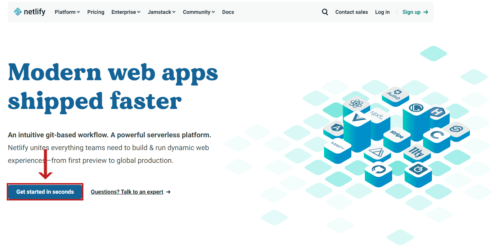
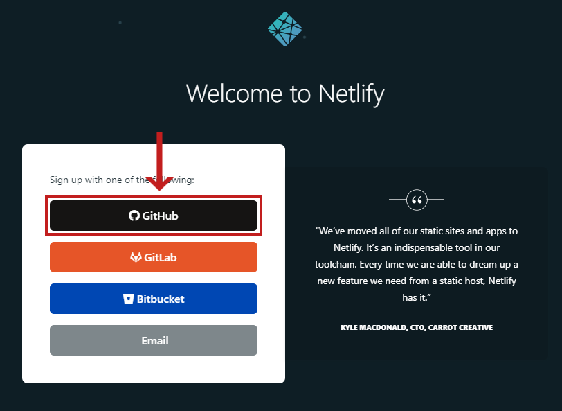
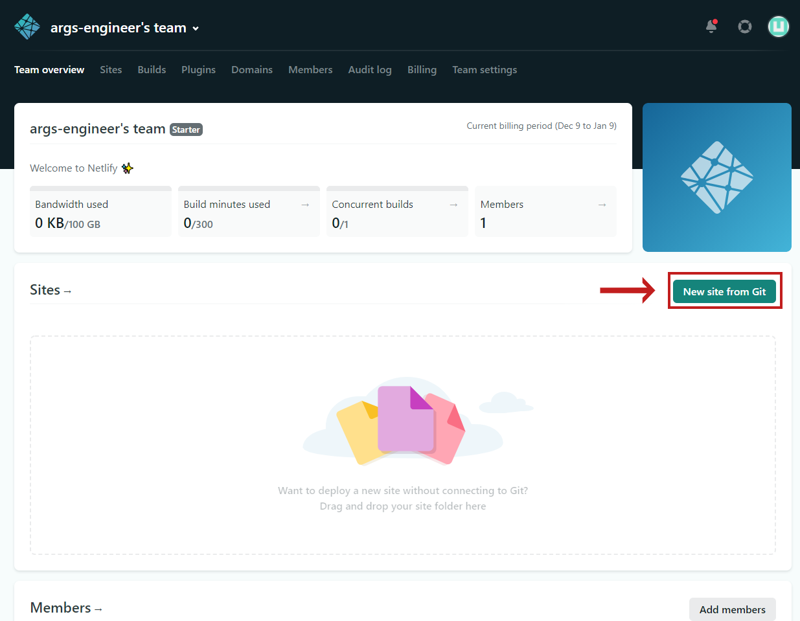
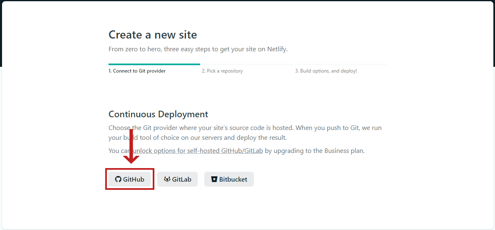
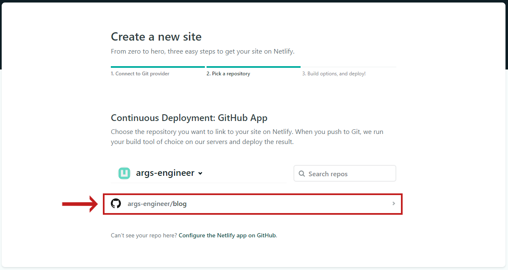
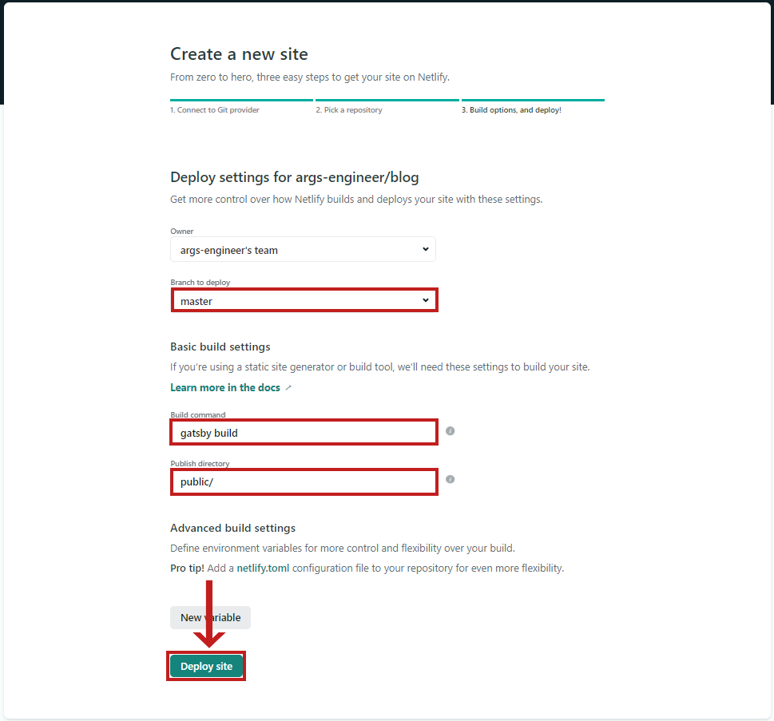
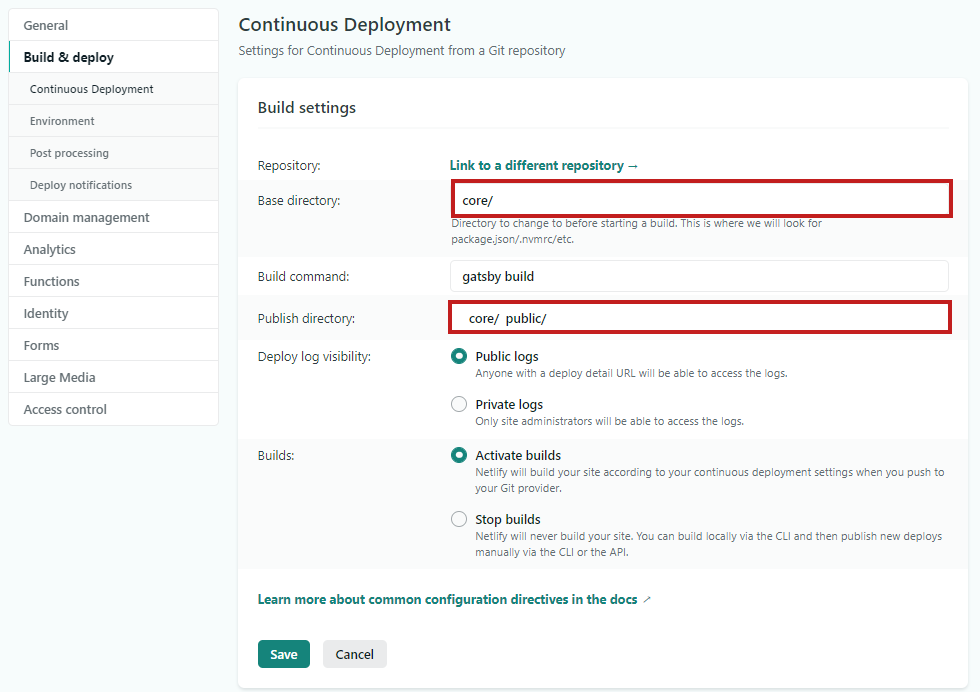
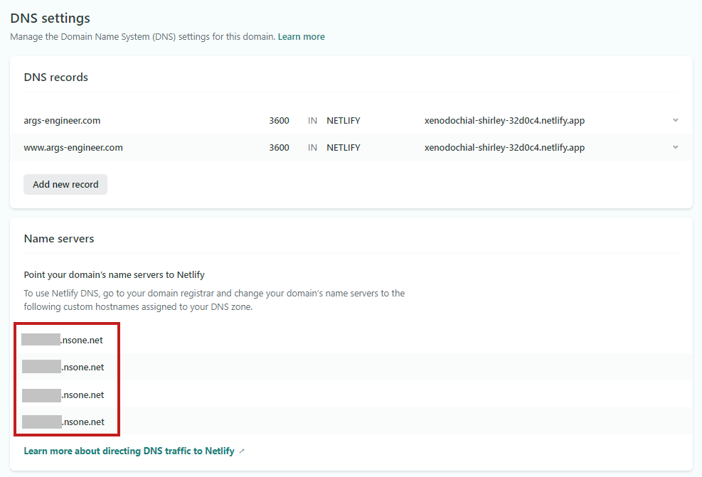
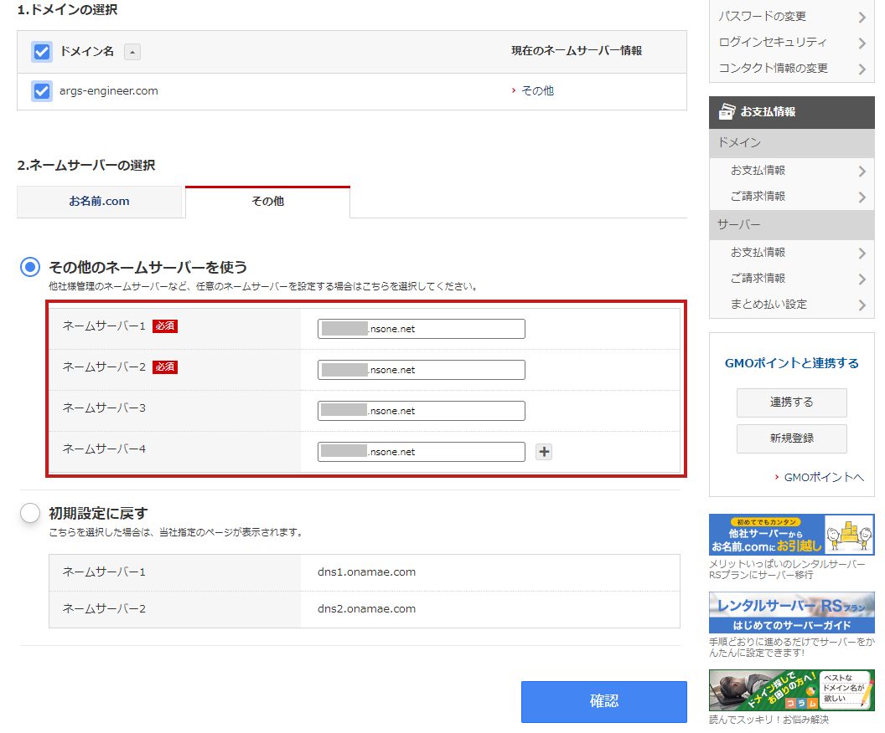
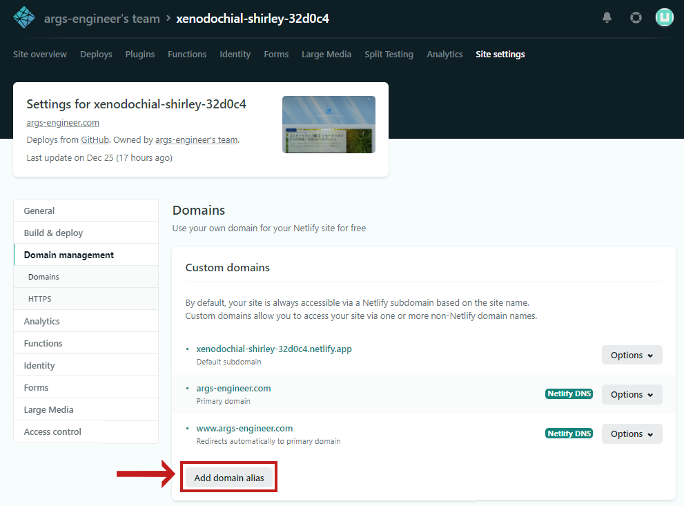

### 前回のあらすじ

>当サイトは[React](https://ja.reactjs.org/)の学習を兼ねたポートフォリオとして作成しました。 
>ひとまず土台が完成したため、今後は以下のロードマップを目安に少しずつ改修を進めていきます。
>また、せっかくですので個人ブログとしても積極的に活用していきたいと考えています。 
>具体的にはReactやC#の技術発信、フリーランスエンジニアとしての活動、雑記などなどを継続的に記事の追加をしていければ嬉しいです。

前回の記事ではVisual Studio Codeを使ったGitHubへのプッシュをお話ししました。 
当記事では最後にNetlifyを使ったサイトの公開方法を解説します。

　<small>前回：[リモートリポジトリの作成・GitHubへのプッシュ](/start-up-04/)</small>

---

### 前提知識：Netlifyとは？

- [Netlify](https://www.netlify.com/)は静的Webサイトのためのホスティングサービス（サーバーをレンタルするサービス）です。
- GitHubなどのリモートリポジトリと連携することで、ブランチへのプッシュをトリガーに自動でリポジトリのデプロイと公開ができます。
- 同じホスティングサービスである[GitHub Pages](https://pages.github.com/)と性質が似ていますが、NetlifyはGitHub、Gatsbyとの相性が非常に良いです。

---

### Netlifyを使ったデプロイ（サイト公開）

Netlifyは非常に明快なステップでアカウントとサイトを作ることができます。 
最初に、[公式ページ](https://www.netlify.com/)の`Get started in secounds`ボタンを押下します。

アカウント情報を入力して、新規にNetlifyのアカウントを作成します。 
サインアップにはGitHubのアカウントを使用しましょう。（GitHubの認証画面に遷移します。）

アカウントの作成が完了するとチームページに遷移します。 
次は`New site from Git`ボタンを押下し、新規にサイトを作成します。

ここでもGitHubを選択します。（再度GitHubの認証画面に遷移します。）

連携対象のリポジトリを選択します。

最後に、デプロイのオプションを入力します。 
- `Branch to deploy`にはデプロイ対象のブランチ名を入力します。このブランチへのプッシュを検知して自動でビルド&デプロイが実行されるようになります。
- `Build command`には`gatsby build`と入力します。ビルド実行時のコマンドになります。
- `Public directory`にはビルド後にバンドル（プログラミング用語で実行コードのまとまりのこと。英語の意味は「束」）を格納しているフォルダを設定します。ここでは`public/`と入力します。

設定が完了したら`Deploy site`ボタンを押下します。サイトの作成とデプロイ、公開が同時に行われます。

公開に成功すると`XXXXXX.netlify.app`というデフォルトのURLでサイトが閲覧できるようになります。

### 補足：ビルド&デプロイに失敗するとき

まずはローカル環境で正常に`gatsby build`と`gatsby serve`が成功するか確認します。 
問題がなければチームページからサイトページに遷移して`Site overview`タブを選択し、`Site settings`→`Build & deploy`→`Edit settings`の順で`Build settings`ページを開きます。

`Base directory`と`Public directory`の項目を確認し、`Public directory`のフォルダの位置が正しいか確認しましょう。 
当サイトの場合はリポジトリの最上層が`core`となっているため、`Public directory`（バンドルを格納しているフォルダ）の位置は`core/public/`になります。

---

### カスタムドメインの設定

このままでもデフォルトのURLでも良いですが、独自のドメインにしたい場合は以下の手順で設定します。 
チームページから`Team overview`→`Domains`タブを選択→サイト名を押下→`DNS settings`に遷移し、`Name servers`の値を確認します。

次にドメインを取得しましょう。私はドメインサービスに[お名前.com](https://www.onamae.com/)を選択し、`args-engineer.com`というドメインを取得しました。

`ネームサーバーの設定`から、`args-engineer.com`というドメインと先ほど確認した`Name servers`の値の紐づけを行います。 
ネームサーバーとは、独自に作成した文字列であるドメインと実際のサーバーの仲立ちをしてくれるサーバーで、以下の説明が詳しいです。

>ネームサーバーとは、インターネット上でドメインとWebサーバーやメールサーバーを結びつけるための名前解決をするサーバーです。
>
>インターネット上にあるサーバー（コンピューター）には、
>すべてIPアドレス（123.145.167.189のように数字で構成されたもの）が割り振られています。
>IPアドレスが判明すれば、実際にホームページやメールを運用しているサーバーにアクセスすることができます。
>
>このIPアドレスとドメインを結び付ける役割を担っているのがネームサーバーとなります。
>いわば、電話番号（ドメイン）と電話機（サーバー）を結びつける電話線のようなものです。
>
>なお、ネームサーバーは【DNS（Domain Name System）サーバー】と呼ばれることもあります。

　<small>引用：[【ドメイン】ネームサーバー（DNSサーバー）とは？｜ヘルプサポート | ドメイン取るならお名前.com](https://help.onamae.com/answer/8072)</small>

`その他のネームサーバーを使う`を選択し、Netlifyのネームサーバーの値を1~4まで順に入力します。

これでドメイン側の設定は終わりです。 
あとはNetlify側でサイトページから`Site overview`→`Site settings`→`Domain management`に遷移し、`Add domain alias`ボタンを押下して取得したドメイン名を入力すれば完了です。

ドメイン設定が完全に反映されるまでは30分～1時間程度掛かりますので焦らずに待ちましょう。 
これでGatsbyベースかつ独自ドメインのサイトを公開することができました！

　<small>参考：[Custom domains | Netlify Docs（Netlify公式）](https://docs.netlify.com/domains-https/custom-domains/)</small> 
　<small>参考：[Netlify DNS | Netlify Docs（Netlify公式）](https://docs.netlify.com/domains-https/netlify-dns/)</small>

---

### おわりに

5記事にわたってReact + Gatsbyで作るサイトのアーキテクチャの選定からデプロイに至るまでをお話ししましたが、実際の作業はトライアンドエラーの繰り返しでなかなか思うようにはいきませんでした。 
特にGatsbyとNetlifyに関してはまだ日本語の情報が少なく、英語のドキュメントとの戦いでした。

それに、最初の土台の完成から公開に至るまで半月以上がかかりました。土台の完成で一度力尽きてしまい、しばらく作業が手につかなくなってしまったためです…（笑） 
そこから何とか自分を鼓舞して公開にこぎつけることができました！まだまだシンプルなサイトですが、これからもっとパワーアップさせていきたいですね！

記事の充実は勿論、やってみたいこともいくつかあります。今後の改修の方針については以下の記事にロードマップ（という名のチェックリスト）を載せています。 
こちらを少しずつ時間をかけてすべて消化できるように目指します。 
　<small>参考：[当サイトについて](/about/)</small>

ここまでお読みいただき、ありがとうございました。